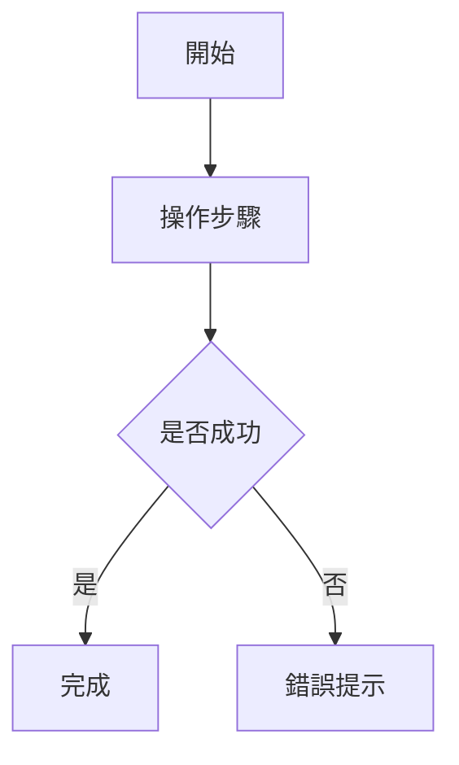
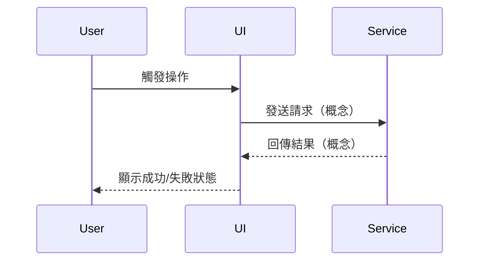
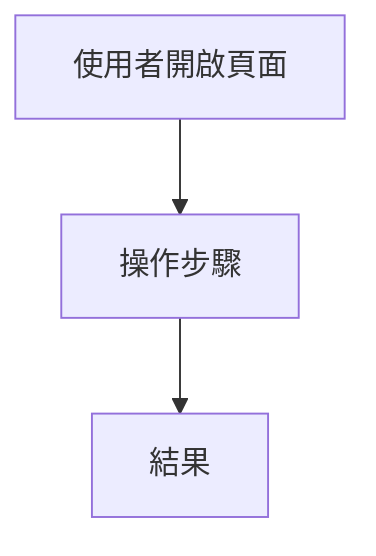
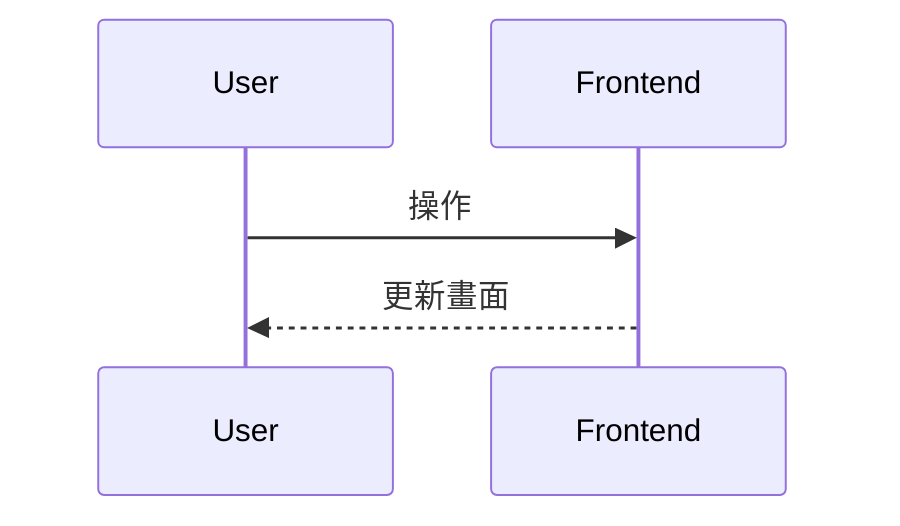
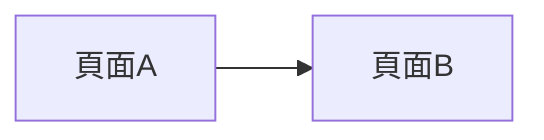

# {功能名稱} PRD（教學版）

> 本範本用於「先產生 PRD，再做 Storybook mockup」的教學流程。  
> 預設沒有既有前端/後端程式碼可參照，所有技術內容以「需求溝通」為主。

---

## 1. 文件資訊

- **文件類型**：產品需求文件（PRD）
- **功能名稱**：{功能名稱}
- **版本**：1.0.0
- **作者**：{姓名/角色}
- **最後更新**：{yyyy/mm/dd}
- **目標讀者**：PM、前端、後端、UI/UX、QA、學生專題成員

---

## 2. 問題定義與目標

### 2.1 要解決的問題

- {目前痛點}
- {舊流程的困難}

### 2.2 產品目標

- {目標 1}
- {目標 2}

### 2.3 成功指標（可觀察）

- {例：完成流程比例提升到 xx%}
- {例：使用者平均完成時間低於 xx 分鐘}

---

## 3. 使用者角色與使用情境

### 3.1 角色列表

| 角色 | 描述 | 主要目標 |
|------|------|----------|
| {角色A} | {描述} | {目標} |
| {角色B} | {描述} | {目標} |

### 3.2 主要使用情境（User Story）

- 身為 {角色}，我想要 {行為}，以便 {價值}。
- 身為 {角色}，我想要 {行為}，以便 {價值}。

---

## 4. 範圍界定（Scope）

### 4.1 In Scope（本次要做）

- {功能項目 1}
- {功能項目 2}

### 4.2 Out of Scope（本次不做）

- {不做項目 1}
- {不做項目 2}

### 4.3 MVP 定義

- 最小可行版本需包含：
  - {必要條件 1}
  - {必要條件 2}

---

## 5. 功能需求（Functional Requirements）

| 編號 | 需求描述 | 優先級（Must/Should/Could） | 驗收方式 |
|------|----------|------------------------------|----------|
| FR-01 | {描述} | Must | {如何驗收} |
| FR-02 | {描述} | Should | {如何驗收} |

---

## 6. 畫面與互動需求（給 Storybook 用）

### 6.1 畫面清單

| 畫面 ID | 畫面名稱 | 目的 |
|--------|----------|------|
| SC-01 | {畫面名稱} | {目的} |
| SC-02 | {畫面名稱} | {目的} |

### 6.2 各畫面互動重點

#### SC-01 {畫面名稱}

- 顯示資訊：{欄位/區塊}
- 使用者可操作：{按鈕/輸入/切換}
- 成功狀態：{畫面反應}
- 失敗狀態：{錯誤訊息與處理}

#### SC-02 {畫面名稱}

- 顯示資訊：{欄位/區塊}
- 使用者可操作：{按鈕/輸入/切換}
- 成功狀態：{畫面反應}
- 失敗狀態：{錯誤訊息與處理}

---

## 7. 資料需求（Data Requirements）

### 7.1 核心資料實體

| 實體 | 用途 | 說明 |
|------|------|------|
| {EntityA} | {用途} | {描述} |
| {EntityB} | {用途} | {描述} |

### 7.2 欄位定義（示例）

```ts
interface ExampleEntity {
  id: string;
  name: string;
  status: 'draft' | 'active' | 'closed';
  createdAt: string;
}
```

> 可依功能擴充。若尚未定案，請標註「待確認」。

---

## 8. 狀態與流程規則（State & Rules）

### 8.1 狀態定義

| 狀態 | 進入條件 | 可執行操作 | 離開條件 |
|------|----------|------------|----------|
| {stateA} | {條件} | {操作} | {條件} |
| {stateB} | {條件} | {操作} | {條件} |

### 8.2 業務規則

- {規則 1}
- {規則 2}

---

## 9. 場景與例外處理（Scenarios & Edge Cases）

至少列出以下四類：
1. 正常完成流程
2. 驗證/輸入失敗
3. 中斷後回來繼續
4. 重複操作或資料衝突

可用表格描述：

| 場景 | 觸發條件 | 系統反應 | 使用者看到什麼 |
|------|----------|----------|----------------|
| {場景A} | {條件} | {反應} | {畫面} |
| {場景B} | {條件} | {反應} | {畫面} |

---

## 10. Flowcharts（Mermaid）

### 10.1 User Flow



### 10.2 System Flow



---

## 11. Mock Data 規劃（給 Storybook）

- 主要資料集：{資料名稱}
- 每筆資料必要欄位：{欄位列表}
- 需要模擬的狀態：
  - {成功}
  - {失敗}
  - {空資料}
  - {載入中}

---

## 12. 驗收條件（Acceptance Criteria）

- [ ] 功能需求（FR）皆可在 mockup 情境中演示
- [ ] 成功與失敗流程都有對應畫面
- [ ] 欄位與狀態定義可被前後端理解
- [ ] PRD 內容足夠支持 Storybook 製作

---

## 13. 後續工作（Next Steps）

- 依本 PRD 產生 Storybook mockup
- 與前端討論元件與互動細節
- 與後端討論 API 與資料模型
- 補齊測試情境（手動/自動）

---

**文件結束**
# {功能名稱} Mockup PRD（給後端 API 規格產生器使用）

> backend-api-spec-generator 會讀取這份文件與 Storybook mockups 來產生後端 API 規格。

---

## 1. 文件資訊

- **文件類型**：Mockup 需求規格書（前後端共用視圖）
- **適用對象**：前端開發、後端開發、產品、QA
- **最後更新**：{yyyy/mm/dd}
- **版本**：1.0.0
- **對應 Storybook**：`storybook/src/stories/mockups/{category}/{FeatureName}.stories.ts`
- **Storybook 連結**：<https://storybook.wport.me/?path=/docs/{story-id}--docs>（請將 `
- **建立日期**：{yyyy/mm/dd}

---

## 2. 開發進度與設計來源

### 開發進度

- **前端 PR #**：[TBD / 待開發後補上]
- **後端 PR #**：[TBD / 待開發後補上]

### 設計來源

- **Figma 連結**：[待補上]
- **Pixsole / 既有畫面**：（若有參照請註明）

---

## 3. 模擬頁面摘要（Mockup Summary）

### 3.1 功能概述

- **功能名稱**：{功能名稱}
- **主要使用者角色**：{Job Seeker / Employer / Admin / 等}
- **核心目標**：
  - {這個功能要解決的問題}

### 3.2 範圍界定

- **包含範圍**：
  - {頁面 / 區塊 / 行為 1}
  - {頁面 / 區塊 / 行為 2}
- **排除範圍**：
  - {明確不做的部分}

### 3.3 成功條件

- {成功條件 1}
- {成功條件 2}

---


### 5.1 實體列表

| 實體名稱 | 說明 | 來源頁面/區塊 |
|----------|------|----------------|
| {EntityA} | {用途說明} | {例：成員選擇下拉、主列表} |
| {EntityB} | {用途說明} | {例：詳細側邊欄} |

### 5.2 實體欄位定義（TypeScript 介面）

#### {實體名稱}（例：CompanyMember）

```ts
interface CompanyMember {
  enc_id: string;             // 成員加密 ID
  name: string;
  email: string;
  photo_url?: string;
  role_code: 'OWNER' | 'ADMIN' | 'MANAGER' | 'MEMBER';
  role_name: string;
  email_verified: boolean;
  status: 'joined' | 'invited' | 'declined' | 'canceled';
}
```

（依本功能補齊其他實體）

---

## 6. 畫面區塊與資料需求（UI Sections & Data Needs）

### 6.1 區塊列表

| 區塊 ID | 區塊名稱 | 說明 |
|--------|----------|------|
| SEC-1 | 主列表區塊 | 顯示列表資料 |
| SEC-2 | 篩選與搜尋列 | 關鍵字、條件篩選 |
| SEC-3 | 詳細資訊區 | 單筆詳細（側邊欄/Modal） |
| SEC-4 | 操作 Modal | 新增/編輯/批次等 |

### 6.2 各區塊資料需求

#### SEC-1 主列表區塊

- **顯示實體**：`{EntityName}[]`
- **資料需求**：分頁（page, page_size）、篩選（keyword, status…）、排序（order_by, order_direction）
- **空狀態**：無資料時顯示空狀態文案與 CTA

#### SEC-2 篩選與搜尋列

- **元件**：關鍵字輸入、條件下拉、多選等
- **是否即時打 API**：{是 / 否，例：debounce 300ms 後呼叫}

（其餘區塊依實際補齊）

---

## 7. 使用者動作與後端需求（User Actions & Backend Needs）

| 動作 ID | 動作名稱 | 類型 | 需要後端 | 涉及實體 | 說明 |
|--------|----------|------|----------|----------|------|
| ACT-1 | 搜尋/篩選 | 查詢(Read) | ✅ 是 | {實體} | 關鍵字或條件觸發重新載入 |
| ACT-2 | 切換分頁 | 查詢(Read) | ✅ 是 | {實體} | 變更 page 後重查 |
| ACT-3 | 開啟詳細區 | UI | ❌ 否 | {實體} | 前端從既有資料取用 |
| ACT-4 | 送出表單/批次操作 | 寫入(Write) | ✅ 是 | {實體} | 傳送 payload 至後端 |

> 真正的 API path/method 由 backend-api-spec-generator 產出，此表僅標示「是否需要後端」。

---

## 8. API Hints（提示用，非最終 API 設計）

### 8.1 資料讀取需求（Read）

- **HINT-GET-1**：{例：取得可轉移成員清單}
  - 對應區塊：{SEC-X}
  - 條件：{keyword、分頁、篩選等}

- **HINT-GET-2**：{例：取得單筆詳細}
  - 對應區塊：{SEC-X}
  - 輸入：{enc_id 等}

### 8.2 資料寫入需求（Write）

- **HINT-MUTATION-1**：{例：執行擁有權轉移}
  - 輸入：{new_owner_enc_id, verification_text 等}
  - 行為：{簡述}

（依實際功能補齊）

---

## 9. 導航 / Storybook Map

- **Storybook 標題**：`Mockups/{功能分類}/{功能名稱}`
- **Stories 路徑**：`storybook/src/stories/mockups/{category}/{FeatureName}.stories.ts`
- **Storybook 連結**：<https://storybook.wport.me/?path=/docs/{story-id}--docs>（請替換為實際 Story ID；產出後請將此連結同時附在 PRD 與對應 Trello 卡片上）
- **情境控制**：（若有 scenario toggles 請列出 args/controls）
- **對應 production 路由**：（僅供參考，不在此新增路由）

---

## 10. Flowcharts（User / System / Navigation）

### 10.1 User Flow（使用者操作流程）



### 10.2 System Flow（前端狀態與資料流）



### 10.3 Navigation / Story Flow（可選）



---

## 11. Mock Data Schema（Mock 資料結構）

- **資料來源**：僅 mock，不呼叫真實 API
- **CRUD 行為**：mock 內所有新增/修改/刪除僅存在元件狀態，重新整理後還原
- **情境切換**：（若有 scenario toggles，簡述如何切換與影響的 UI）

---

## 12. 實作備註（Implementation Notes）

- **禁止事項**：
  - ❌ 本文件不直接定義最終 API path/method，僅提供 Hints
  - ❌ 不直接修改 `prd/business-rules.md`，新規則先在「商業規則對齊」描述，再由人決定是否回寫
- **注意事項**：
  - 欄位命名與 Storybook/TS interface 一致
  - 若有 Pixsole 或既有畫面參照，還原度目標 95%，並在 PRD 註明

---

## 13. 下一步（Next Steps）

- {例：與後端對齊 API 規格後實作}
- {例：補齊 i18n key}
- {例：撰寫 E2E 情境}

---

**文件結束**
