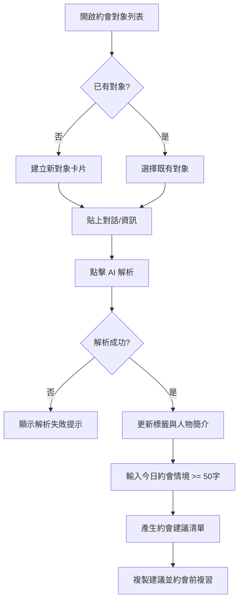
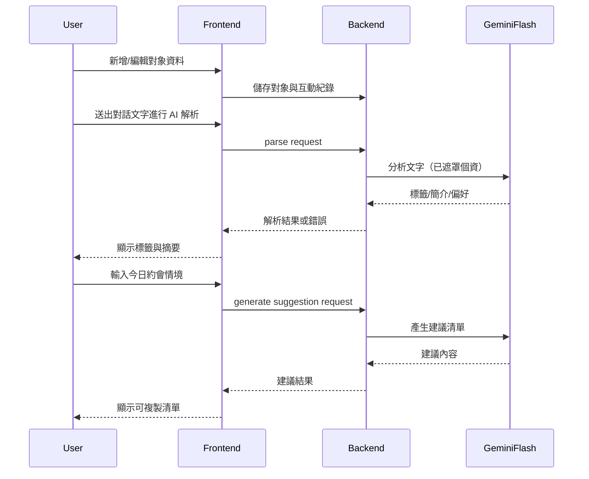

# 約會對象紀錄系統 PRD

> 本文件為產品需求主文（PRD）。  
> Mockups 與 Storybook 規格請見：`doc/mockups/dating-target-record-mockups-spec.md`

---

## 1. 文件資訊

- **文件類型**：Product Requirement Document（PRD）
- **適用對象**：前端、後端、產品、QA、學生專題成員
- **最後更新**：2026/04/24
- **版本**：1.0.0
- **PRD 代號**：prd#1
- **功能名稱**：約會對象紀錄系統

---

## 2. 功能摘要

### 2.1 目標

- 讓使用者可管理多位約會對象資訊，避免忘記關鍵細節影響互動品質。
- 透過 AI 自動整理對話重點，快速提供約會前複習與當日建議。

### 2.2 使用者

- **主要角色**：單一使用者（本機自用）

### 2.3 成功條件

- 使用者能持續記住對象細節，降低忘記名字或偏好的情況。
- 使用者可在約會前 1 分鐘內完成重點複習與建議查看。

---

## 3. 範圍（包含 / 排除）

### 3.1 包含範圍

- 約會對象卡片 CRUD
- 對話文字貼上與 AI 解析（標籤、簡介、關鍵偏好）
- 約會前「今日約會意見」輸入與建議清單產出（輸入最少 50 字）
- 約會歷史 log 與每次評分
- 卡片列表與 filter 篩選
- 本機草稿保留

### 3.2 排除範圍

- 即時聊天串接
- 行動 App
- 推播通知
- 資料匯出/刪帳清除流程 UI

---

## 4. 商業規則

- **BR-NEW-01**：每位使用者最多建立 100 位約會對象。
- **BR-NEW-02**：每位對象最多 1000 筆互動紀錄。
- **BR-NEW-03**：AI 建議輸入文字低於 50 字時不得產生建議。
- **BR-NEW-04**：AI 分析前需遮罩個資（電話、IG、地址等）。

---

## 5. 資料實體與欄位（TypeScript 介面）

```ts
interface DatingTarget {
  id: string;
  name: string; // 必填
  note?: string;
  tags: string[];
  aiSummary?: string;
  dateCount: number;
  averageScore?: number;
  createdAt: string;
  updatedAt: string;
}

interface InteractionLog {
  id: string;
  targetId: string;
  type: 'chat' | 'date';
  rawText: string;
  score?: 1 | 2 | 3 | 4 | 5;
  createdAt: string;
}

interface AITagProfile {
  targetId: string;
  extractedHeight?: string;
  extractedAge?: string;
  extractedPreferences: string[];
  personalityTraits: string[];
  summary: string;
  sourceLogIds: string[];
  updatedAt: string;
}

interface DatingPlanSuggestion {
  targetId: string;
  inputContext: string; // 最少 50 字
  suggestions: Array<{
    title: string;
    reason: string;
    caution?: string;
  }>;
  generatedAt: string;
}
```

---

## 6. 畫面區塊與資料需求

| 區塊 ID | 區塊名稱 | 說明 |
|--------|----------|------|
| SEC-1 | 對象卡片列表 | 顯示所有對象與快速操作；卡片最小欄位需含 name/tags/dateCount/updatedAt |
| SEC-2 | 篩選與搜尋列 | 預設提供完整篩選：keyword + tags + scoreRange |
| SEC-3 | 對象詳情區 | 顯示 AI 簡介、歷史 log、評分趨勢 |
| SEC-4 | 新增/編輯卡片 Modal | 建立或更新對象基本資訊；驗證失敗以 toast 為主 |
| SEC-5 | 對話貼上與 AI 解析區 | 貼上文字後觸發解析並顯示結果 |
| SEC-6 | 今日約會意見區 | 輸入情境後產出約會建議；成功後嘗試自動複製，並保留手動複製 |

---

## 7. 使用者動作與後端需求

| 動作 ID | 動作名稱 | 類型 | 需要後端 | 涉及實體 | 說明 |
|--------|----------|------|----------|----------|------|
| ACT-1 | 建立對象卡片 | 寫入(Write) | 是 | DatingTarget | 姓名必填，成功後加入列表 |
| ACT-2 | 編輯對象卡片 | 寫入(Write) | 是 | DatingTarget | 更新姓名/備註等欄位 |
| ACT-3 | 刪除對象卡片 | 寫入(Write) | 是 | DatingTarget | 刪除前二次確認 |
| ACT-4 | 新增互動紀錄 | 寫入(Write) | 是 | InteractionLog | 支援 chat/date 與評分 |
| ACT-5 | 觸發 AI 解析 | 寫入(Write) | 是 | AITagProfile | 解析出標籤、簡介、偏好 |
| ACT-6 | 產生今日約會建議 | 寫入(Write) | 是 | DatingPlanSuggestion | 輸入 >= 50 字才可送出 |
| ACT-7 | 複製約會建議 | UI | 否 | DatingPlanSuggestion | 一鍵複製到剪貼簿 |
| ACT-8 | 篩選/搜尋卡片 | 查詢(Read) | 是 | DatingTarget | 即時更新列表 |
| ACT-9 | 草稿回復 | 查詢(Read) | 是 | DraftBuffer | 中斷重進後恢復未送出內容 |

---

## 8. API Hints（提示用，非最終 API 設計）

### 8.1 Read

- **HINT-GET-1**：取得對象列表（含 filter）
  - 條件：keyword、tags、scoreRange、page、page_size
- **HINT-GET-2**：取得單一對象詳情（含 AI 摘要與歷史）
  - 輸入：targetId
- **HINT-GET-3**：取得草稿內容
  - 輸入：targetId（可選）

### 8.2 Write

- **HINT-MUTATION-1**：新增/更新/刪除對象卡片
  - 輸入：name（必填）與其餘選填欄位
- **HINT-MUTATION-2**：新增互動紀錄並觸發 AI 解析
  - 輸入：rawText、type、score（可選）
- **HINT-MUTATION-3**：產生今日約會建議
  - 輸入：inputContext（最少 50 字）

---

## 9. Flowcharts

### 9.1 User Flow



### 9.2 System Flow



---

## 10. 驗收標準（Priority）

### Must

- Storybook 各情境畫面正確呈現（含空態、失敗態、短字數、草稿回復）。
- 各情境 UI 狀態正確切換（loading / empty / error / success）。

### Should

- 互動流程完整：按鈕 disabled 條件、錯誤提示文案、刪除二次確認行為明確。
- `SEC-4` 驗證錯誤提示採 toast，且刪除流程維持 soft 二次確認文案。

### Could

- 補充 play function 測試重點與 QA checklist。

### Must-pass Stories（對齊 Mockups Spec）

- `List-Empty-Desktop`
- `Modal-Create-Open-Desktop`
- `Detail-Normal-Desktop`
- `Parse-ParseFailed-Desktop`
- `Suggestion-ShortInput-Desktop`
- `Draft-DraftRecovered-Desktop`
- `Flow-NewTarget-Parse-Suggest-Normal-Desktop`

### Rendering Mode（Mockups 對齊）

- 本版 mockups 採 `Flow-first`，優先驗證「新增對象 -> AI 解析 -> 產生今日建議」串聯路徑。

---

## 11. 下一步

- 依 `doc/mockups/dating-target-record-mockups-spec.md` 產出 Storybook stories。
- 與後端對齊 AI 解析與建議產生的錯誤碼格式。
- 補齊資料匯出與刪帳清除流程（非本版 UI 範圍）之後續規劃與驗收測試。

